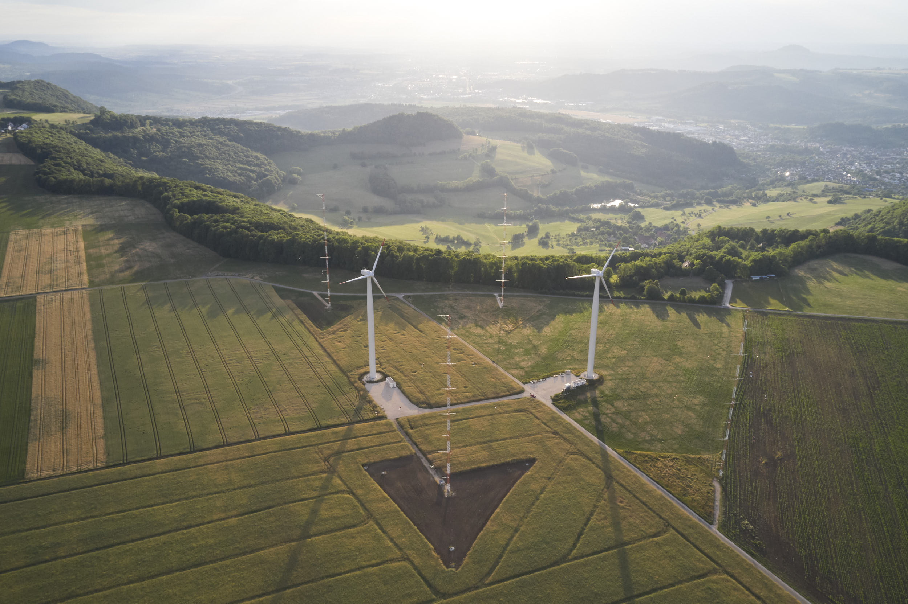

WINSENT Benchmark
=================

The WINSENT benchmark is being performed under the umbrella of the IEA Wind TCP Task 57 Joint Assessment of Models. 

Intro
-----

The WINSENT benchmark is focused on atmospheric inflow, turbine response, and wake behavior in complex terrain.
It follows the collaborative benchmarking style used in the prior JAM benchmark efforts, with staged participation 
and shared reference data.

How to Participate
------------------

- Review the page :doc:`description` for campaign context and motivation.
- Contact the benchmark leader and participate in working group meetings.
- Submit modeling results following guidelines given in the :doc:`submissions` page.

.. toctree::
   :maxdepth: 3
   :caption: Contents

   description
   winsent
   phase_I
   phase_II
   submissions
   contact
