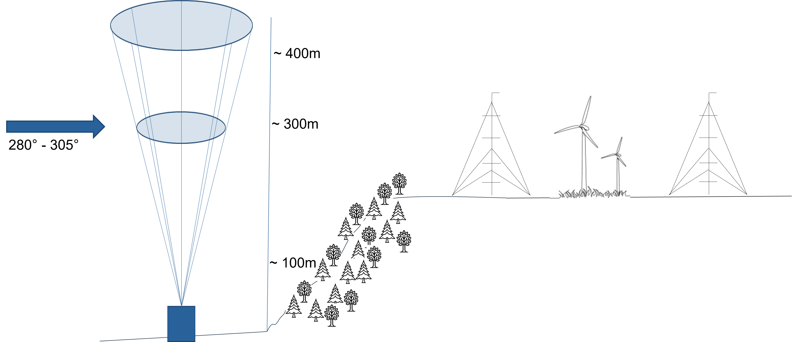
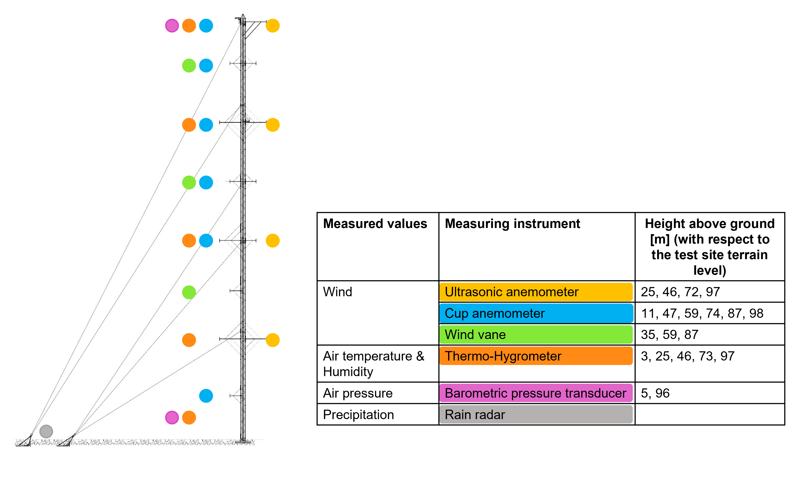
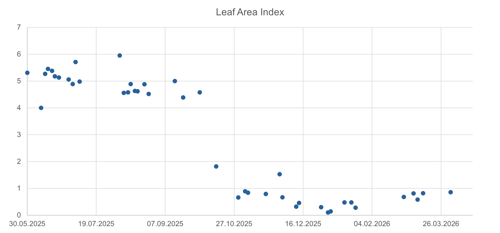

The WINSENT test site
=====================

A general description of the WINSENT test site can be found here:

- https://winsent.de/en
- https://doi.org/10.5281/zenodo.17222809

The following abbreviations are used for the research wind turbines and the four meteorological measuring masts:

.. list-table::
   :header-rows: 0

   * - RWTN
     - Northern research wind turbine

   * - RWTS
     - Southern research wind turbine

   * - MMNW
     - Meteorological mast installed in the northwest of the test site

   * - MMNE
     - Meteorological mast installed in the northeast of the test site

   * - MMSW
     - Meteorological mast installed in the southwest of the test site

   * - MMSE
     - Meteorological mast installed in the southeast of the test site

The following figures illustrate the layout of the test site and a schematic cross-section of 
the experimental setup, with the test site located on the hill and the lidar positioned in the valley.

.. image:: images/test_site_layout.png

The hub height of the turbines on the plateau roughly corresponds to an elevation of 300 meters above 
ground level relative to the valley.  

The mean wind direction at the test site is west-northwest as can be seen from the wind rose that is 
based on measurements at hub height at MMNW in 2025. 

.. image:: images/wind_rose_MMNW.png
  :scale: 70

.. _coordinates:
Coordinates
-----------

The current official reference system for position and elevation data in Germany is the German Reference Network (DREF91), 
which is aligned with the European Terrestrial Reference System 1989 (ETRS89): ETRS89/DREF91/2016 + DHHN2016 (see https://epsg.io/10293).
The location is specified by longitude and latitude, and the elevation is given in meters relative to Normalhöhennull (NHN), 
the official German vertical height reference datum.
Conversion to other reference systems is possible with very high accuracy.
The center coordinates of the meteorological masts and turbine towers are calculated from coordinates measured 
on site by a surveying office in March 2024. The coordinates of the lidar are obtained from GPS measurements 
taken during the installation, and the values are verified using the GIS system.

.. list-table:: 
   :header-rows: 1

   * - Structure
     - Longitude [°]
     - Latitude [°] 
     - Height [m NHN]
   * - RWTN
     - 9.837730119766245
     - 48.666210346923343
     - 666.03
   * - RWTS
     - 9.837125414111535	
     - 48.664973120775961
     - 666.61	
   * - MMNW
     - 9.835916275260756	
     - 48.666156314185706
     - 665.00
   * - MMNE
     - 9.839397041100227	
     - 48.666276556003453
     - 662.47
   * - MMSW
     - 9.835293548617226
     - 48.664941603518201	
     - 664.57
   * - MMSE
     - 9.838955754497034	
     - 48.665024675916257	
     - 664.91
   * - Lidar (L140)
     - 9.819179271256603
     - 48.673039540602765
     - 468.80

A \*.geojson file containing the coordinates is provided on Zenodo. 

Meteorological measurement masts
--------------------------------

All four measurement masts are equipped with a wide range of measuring instruments. A selection of these is 
shown in the schematic diagram below.

Please note that the ultrasonic anemometers at height 97m were out of order for an extended period of time, 
and therefore the data from this sensor cannot be used for the benchmark.

For the sake of simplicity, the benchmark assumes that all measuring instruments are positioned in the center 
of the measuring mast and that all measuring masts are equipped identically. In reality, the measuring instruments 
are mounted on booms (max. 5m).

Determination of the leaf area index
------------------------------------

The leaf area index (LAI) is determined using the sentinel satellite data with the help of this website
https://viewer.terrascope.be/
for the shown area:

.. image:: images/LAI_area.png

The trend of the LAI value over time is as follows:

Each point represents a measured value. The trend shows that the LAI value remains high until the end of 
September and then drops to a lower level over the course of October. Therefore, all data prior to October 5, 2025, 
will be assigned a high LAI value (mean value = 5.0), and all data after October 13, 2025, will be assigned a low 
LAI value (mean value = 0.7). 
The period in between will be excluded from the analysis, as satellite data are not continuously available during 
this time.

For detailed LAI data see :ref:`laidata`.

Terrain data
------------
This section provides an overview of the geospatial datasets available for the WINSENT site.
Data is organized by spatial extent to support both localized modeling and broader mesoscale-to-microscale coupling:

- :ref:`rad10`: High-resolution local data
- :ref:`rad300`: Globally available data

All terrain data is available on Zenodo in two coordinate reference systems (CRS):

- WGS84 (EPSG:4326) – Global latitude/longitude  
- ETRS89-Extended (EPSG:3035) – European, used by Copernicus  

However, the LAI data is only available in EPSG:4326.
Additional projections (e.g., local UTM zones), extents or resolutions are possible upon request.

The data is freely available.
For details and licensing information of individual datasets, please follow the respective links and information.

.. _rad10:
10 km radius
^^^^^^^^^^^^

Digital Terrain Model (DTM)
"""""""""""""""""""""""""""
Local elevation model of the ground without vegetation or buildings.  
- Format: GeoTIFF
- Resolution: 0.25 m.  

| Data source (German): https://www.lgl-bw.de/Produkte/3D-Produkte/Digitale-Gelaendemodelle/  

| Legal information:
- German: https://www.lgl-bw.de/Produkte/Open-Data/index.html
- Translated: The open geodata and geodata services of the Baden-Württemberg Surveying Administration can be used free of charge under the terms of the Data License Germany - Attribution - Version 2.0 (http://www.govdata.de/dl-de/by-2-0). The attribution must be made as follows: “Data source: LGL, www.lgl-bw.de, dl-de/by-2-0”.

Digital Surface Model (DSM)
"""""""""""""""""""""""""""
Local surface elevation including vegetation, buildings, and other structures.  
- Format: GeoTIFF
- Resolution: 1 m  

Data source (German): https://www.lgl-bw.de/Produkte/3D-Produkte/Digitale-Oberflaechenmodelle/DOM1/ 

Legal information:
- German: https://www.lgl-bw.de/Produkte/Open-Data/index.html  
- Translated: The open geodata and geodata services of the Baden-Württemberg Surveying Administration can be used free of charge under the terms of the Data License Germany - Attribution - Version 2.0 (http://www.govdata.de/dl-de/by-2-0). The attribution must be made as follows: “Data source: LGL, www.lgl-bw.de, dl-de/by-2-0”.

Land Cover Data
"""""""""""""""
See :ref:`clcdata` of the large area, it is the same data source.

Leaf Area Index (LAI)
"""""""""""""""""""""
See :ref:`laidata` of the large area, it is the same data source.

.. _rad300:
300 km radius
^^^^^^^^^^^^^

Digital Elevation Model (DEM)
"""""""""""""""""""""""""""""

Global elevation model, NASADEM
- Format: GeoTIFF
- Resolution: 30 m  

Data source: NASADEM Merged DEM Global 1 arc second V001 [Data set]. NASA Land Processes Distributed Active Archive Center. https://doi.org/10.5067/MEASURES/NASADEM/NASADEM_HGT.001 Date Accessed: 2026-06-12

Legal information: https://www.earthdata.nasa.gov/data/catalog/lpcloud-nasadem-hgt-001#toc-citation

.. _clcdata:
Land Cover Data
"""""""""""""""

Copernicus Corine Land Cover Plus Backbone (CLCplus) 2023  
- 11 land cover classes (see below)
- Format: GeoTIFF
- Resolution: 10 m
  
Data source: https://land.copernicus.eu/en/products/clc-backbone/clcplus-backbone-2023-raster-10-m-europe-2-yearly

Legal information:  
- https://doi.org/10.2909/b0bd43c6-1fa1-4d88-9c45-98b13a95d0b2  
- https://www.copernicus.eu/en/access-data  
- https://www.copernicus.eu/en/access-data/copyright-and-licences

Legend of CLCplus classes:

.. list-table:: 
   :header-rows: 1

   * - Class integer
     - Class name
   * - 1
     - Sealed
   * - 2
     - Woody needle-leaved trees
   * - 3
     - Woody broad-leaved deciduous trees
   * - 4 
     - Woody broad-leaved evergreen trees
   * - 5 
     - Low-growing woody plants
   * - 6 
     - Permanent herbaceous
   * - 7 
     - Periodically herbaceous
   * - 8 
     - Lichens and mosses
   * - 9 
     - Non- and sparsely vegetated
   * - 10 
     - Water
   * - 11 
     - Snow and ice
   * - 253 
     - Coastal seawater buffer
   * - 254 
     - Outside area
   * - 255 
     - No data

.. _laidata:
Leaf Area Index (LAI)
"""""""""""""""""""""

- Spatial resolution: 300m
- Temporal resolution: 10 days
- Format: GeoTIFF
- CRS: only EPSG:4326

The data is provided is provided in single GeoTIFF files for each 10-day period grouped in folders by month.

Data source: Copernicus Leaf Area Index version 2, https://doi.org/10.2909/a696fab4-c3dc-4dcc-b1d8-6fcd9a2ce1eb

